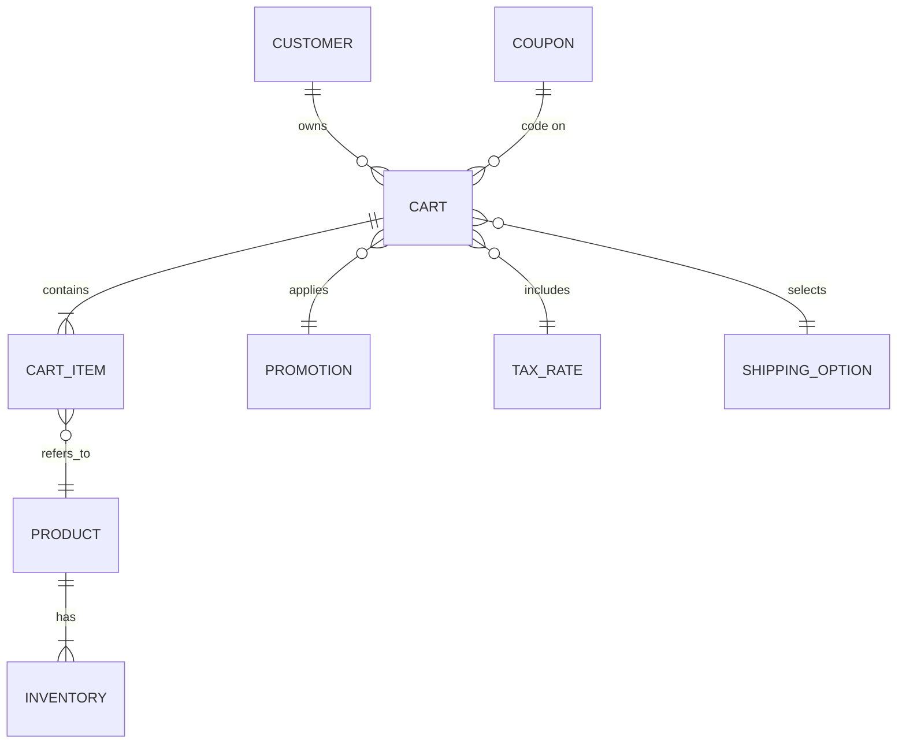

# Executive Summary  
An industrial‑grade e-commerce cart page is both a catalog and a checkout tool【32†L218-L227】. It must **display all items clearly** with images, names, variants, prices and quantities (allowing easy edits/removal)【2†L65-L72】【41†L82-L90】, and it must **summarize costs upfront** (subtotal, shipping, tax, discounts, total) to build trust【1†L118-L120】【34†L264-L268】. Cart pages should load extremely fast (target LCP < 2.5 s)【32†L243-L248】【45†L155-L163】 and adapt fluidly to device breakpoints (e.g. <500 px mobile, 500–1200 px tablet, 1200–1400 px laptop, >1400 px desktop【10†L133-L141】). Developers must understand related data models (e.g. Cart, CartItem, Product, Promotion, Tax, ShippingOption) and backend flows (APIs for add/update/remove, inventory checks, promotions, tax/shipping calculation, secure payment processing)【41†L68-L76】【41†L78-L86】. Integration points include checkout workflows, payment gateways, order management systems (OMS), product information systems (PIM), CDNs and cache layers, and fraud-detection services. The cart page boosts **conversion and trust** by clarifying costs and status【1†L118-L120】【32†L218-L227】, enabling recovery (persistent carts, “save for later”) and upsell (recommendations/bundles)【34†L269-L272】【34†L403-L412】. Key metrics include cart abandonment rate, conversion (cart→checkout), average order value, and performance KPIs (LCP, error rates). A rigorous test suite (unit/integration/E2E/visual/load) is required, as are launch checklists (accessibility audit, security review, analytics tags, etc.) and performance/security standards (e.g. WCAG 2.1 AA, PCI/DSS).  

## Cart Page Essentials: Components and Content  
An MNC‑ready cart page must include the following **key sections/components**:
- **Cart Items List:** A list (often table or cards) of each selected product, showing a *thumbnail*, *title* (linking to product page), *chosen options* (size/color), *unit price*, a *quantity selector*, and *line total*. Each item should allow easy editing (increment/decrement quantity, *remove*)【2†L65-L72】【1†L124-L128】. Optionally include “Save for later” or wishlist links. Cart items act like a comparison tool, so full visibility and editability is crucial; 86% of sites hamper updates/removals, which is a known problem【1†L124-L128】.  
- **Order Summary/Cost Breakdown:** Summarize costs clearly. Required fields: *Subtotal* (sum of items), *shipping*, *tax*, *discounts*, and *grand total*. Include any applied promotions. At minimum show subtotal and total【1†L118-L120】; best practice is to break out shipping and tax (e.g. “Order Total = 
Subtotal + Shipping + Tax – Discounts”) so no surprises. This box must stand out (e.g. border or shaded background) and often includes the **Checkout** button.  
- **Promo Code/Coupon Entry:** An input field to enter discount codes, with an “Apply” button. Show success/error feedback. Optional: auto-apply promotions or provide an “Apply All” toggle for known offers. Accessibility note: label the field and button for screen readers and validate input.  
- **Checkout and Continue Buttons:** A prominent **“Proceed to Checkout”** (or “Checkout Securely”) button is required【34†L325-L331】. It should be sticky/persistent on mobile screens【37†L69-L77】, with clear labelling and focus styles. Also include a **“Continue Shopping”** link (often near top or bottom) that navigates back to browsing. Both must be large click/tap targets (≥44 px【13†L135-L143】) and have aria-labels if needed.  
- **Recommended/Upsell Section:** Below or beside the cart, suggest related or promotional items (“You may also like…”, bundles, cross-sells). Required only if relevant; it should not distract from completing the purchase. Provide images, price, “Add to cart” buttons. Accessibility: ensure keyboard focus and alt text on images.  
- **Trust & Info Signals:** Display security badges, warranty/return links, and user testimonials/reviews near the checkout button to build confidence【37†L141-L150】【34†L409-L412】. Required: SSL/TLS indicator on the site. Optional: real-time support/contact link.  
- **Empty Cart State:** If the cart is empty, show a friendly message (“Your cart is empty”), an illustration or icon, and a **“Shop Now”** button. Offer examples of popular products. Accessibility: ensure the message is in semantic text with alt text if there’s an image.  
- **Additional Features (optional):** “Save Cart” or account login prompt; estimated delivery dates; gift-wrap checkbox or order notes field; loyalty points redemption; currency selector (for multi-currency sites); legal (terms, returns link). These enhance UX but are lower priority than the above essentials.

Each component’s *purpose, required/optional fields, accessibility notes,* and *priority* are summarized in the table below. (High-priority means it’s essential for usability or compliance.)

| Component                | Purpose                                    | Required Fields                                        | Optional Features                        | Accessibility/Notes                                | Priority |
|--------------------------|--------------------------------------------|--------------------------------------------------------|------------------------------------------|----------------------------------------------------|----------|
| **Cart Items List**      | Container for all items in cart            | (none, wraps item rows)                                 | Bulk actions (e.g. “Remove all”)        | ARIA role="list"; responsive layout (grid or list) | High     |
| **Cart Item (row/card)** | Show product in cart (per item)            | Image, Title/Link, Variants (size/color), Price, Qty, Line Total, Remove button | Save-for-later, stock status, notes      | Image alt text; buttons with accessible labels; error if stock low | High     |
| **Order Summary**        | Show cost breakdown & totals               | Subtotal, Tax estimate, Shipping estimate, Discounts, Total | Gift options, loyalty credits           | Use table or list semantics; highlight total        | High     |
| **Coupon/Promo Entry**   | Apply discounts to cart                    | Input field, Apply button                               | Auto-detect coupons                     | Label “Enter promo code”; error messages for invalid codes | Medium |
| **Checkout Button**      | Trigger checkout/next step                 | Button text (“Checkout Secured”), link/handler          | Sticky/floating on scroll              | Large target (≥44×44px)【13†L135-L143】, focus outline | High     |
| **Continue Shopping**    | Return to shopping/catalog                 | Text/link (“Continue Shopping”)                         | Breadcrumb navigation                  | Visible and keyboard-accessible                     | Medium   |
| **Upsell/Recommendations** | Suggest related products or bundles        | Product image, title, price, “Add” or “View” button     | Carousel on mobile                     | Keyboard focusable; alt text on images              | Medium   |
| **Empty Cart Message**   | Inform when no items and prompt action     | Text message, “Shop Now” button                         | Illustration or mascots                | Ensure text is screen-readable; button is focusable  | High     |
| **Trust Signals**        | Build user confidence                      | Icons/text for SSL, secure payments, returns, reviews   | Security badge, guarantees, support link | Provide descriptive text for badges                 | Medium   |
| **Order Notes/Instructions** | Capture special instructions (e.g. gift messages) | Textarea field                                         | Character count                       | Label “Order notes”; mark optional                  | Low      |
| **Legal/Compliance Info** | Disclaimers and links for policies         | Privacy/terms link, tax/VAT notice (if required)        | Region-specific notices               | Ensure accessible link text (“Privacy Policy”)      | Medium   |

## Responsive Design Requirements  
The cart **must be fully responsive**. Use breakpoints and fluid layouts so that on small screens it remains usable. A common strategy is 2–4 breakpoints (e.g. “XS” up to ~500 px, “S” 500–1200px, “M” 1200–1400px, “L” >1400px) as guidance【10†L133-L141】.  

- **Mobile (<500 px):** Layout collapses to one column. The **navigation collapses** to a hamburger/menu icon【10†L152-L159】. Cart items stack vertically; each item row becomes a full-width card. The order summary typically moves below the item list (or as a sticky footer) with a single-column layout. The “Checkout” button should be **sticky** or easily reachable (as part of bottom bar)【37†L69-L77】. Tap targets must be large (>=44×44 px【13†L135-L143】) and well-spaced. For example, quantity buttons and “Remove” must be thumb-reachable. The upsell section (if shown) often becomes a horizontal carousel or is hidden on mobile to save space.  
- **Tablet (500–1200 px):** Often 2–column grid: cart items on the left, order summary (and continue/checkout) on the right. Alternatively, a vertical list with a horizontal summary panel below. Navigation can remain visible or collapse depending on design. Use slightly smaller tap targets (>=36–44px).  
- **Desktop/Laptop (>1200 px):** Multi-column layout: item list on left, summary on right, possibly a sidebar of upsells or recommendations【10†L152-L159】. Larger images and details are shown. Cart table/grid with multiple columns is acceptable. For very wide screens, you may keep the summary fixed while the item list scrolls.  

Common **adaptive behaviors**【10†L152-L159】 include: moving a sidebar into a hamburger menu, merging or collapsing columns, and showing more content per row on larger screens. Ensure the cart page design “flows” gracefully: columns collapse, elements stack, and font sizes or padding adjust for readability. Use responsive images (e.g. `srcset`) and lazy-load offscreen content (recommendations) for speed. Navigation elements (e.g. site header) should remain accessible. On touch devices, use mobile design patterns: bottom navigation bars, large buttons, progressive disclosure (e.g. collapsible tax/shipping details)【37†L52-L61】【37†L112-L121】. For example, show a simplified order summary by default and allow expanding for details (tax/shipping breakdown) to keep the page clean. 

Importantly, every button and link (especially quantity toggles and “Checkout”) must meet **touch-target guidelines** (minimum 44×44 px【13†L135-L143】). Provide sufficient color contrast (WCAG 2.1 AA) and ensure keyboard accessibility (tab order, focus outlines). Use media queries aligned with content (e.g. break when content wraps) rather than device names, and test on real devices and emulators. Below is a schematic diagram of a typical layout:  

```mermaid
flowchart TB
  classDef desktop fill:#eef,stroke:#333;
  classDef mobile fill:#efe,stroke:#333;
  
  subgraph Desktop (>=1024px)
    direction LR
    HeaderDesktop([Header / Navbar]):::desktop
    ItemsDesktop([Cart Items List (table or cards)]):::desktop
    SummaryDesktop([Order Summary & Checkout]):::desktop
    UpsellDesktop([Related/Recommended Products]):::desktop
  end
  
  subgraph Mobile (<768px)
    direction TB
    HeaderMobile([Header (hamburger nav)]):::mobile
    ItemsMobile([Cart Items (stacked list)]):::mobile
    SummaryMobile([Order Summary (collapsed below items)]):::mobile
    UpsellMobile([Upsell (carousel or hidden)]):::mobile
  end
  
  HeaderDesktop --> ItemsDesktop
  HeaderDesktop --> SummaryDesktop
  ItemsDesktop --> SummaryDesktop
  ItemsDesktop --> UpsellDesktop
  HeaderMobile --> ItemsMobile
  ItemsMobile --> SummaryMobile
  ItemsMobile --> UpsellMobile
```

*(Figure: Example responsive layouts for a cart page.)*

## Data Models and Technical Foundations  
Developers must understand the underlying **data model**: typically a **Cart** (session or user cart) that *contains* multiple **CartItem** records, each linking to a **Product** (and possibly a specific variant or SKU). The Cart includes fields like `subtotal`, selected `currency`, applied `promotions`/coupon codes, and chosen `shipping_option`. A Customer/User may own one active cart【41†L68-L76】【41†L78-L86】. The ER diagram below sketches these relationships:



*(Figure: Simplified ER diagram for cart-related entities.)*

**Key data fields:** A CartItem record typically includes `product_id`, `product_name`, `variant_id`, `unit_price`, `quantity`, and `line_total`. The Cart itself may store a `user_id` (if logged in), plus `cart_total`, `currency`, timestamps, and flags for applied discounts/taxes. Necessary static data (products, taxes, promotions) usually live in other systems (e.g. Product or Tax tables) and are joined at runtime【41†L74-L82】【41†L88-L96】. Carts are transient: once an order is placed, the data may migrate to an **Order** and **OrderItem** table as historical “processed data”【41†L91-L100】.

**APIs:** The front-end should communicate with cart APIs for all actions: “Add item”, “Update quantity”, “Remove item”, “Apply coupon”, and “Fetch cart” (JSON). These endpoints should be RESTful or GraphQL with proper security (CSRF tokens or JWT for session). Backend services manage inventory checks (reject adding if out-of-stock), pricing (including dynamic promotions), tax calculation (via rules or tax APIs), and shipping estimates (via carrier APIs or tables). A typical payment flow involves: customer clicks “Checkout”, the app creates an order in backend, then integrates with a payment gateway (e.g. Stripe, PayPal) via tokenized transaction (often with 3D Secure authentication). Only after successful payment is the order finalized and the cart cleared. Sensitive operations (handling payment data) must comply with PCI DSS and usually use tokenization so no card data touches your server.  

**Inventory and Fulfilment:** The cart should check inventory in real time or reserve stock when order is placed. For high-demand items, consider “soft reserve” (hold item for a short grace period) to avoid overselling. If stock levels change while a user shops, warn them at checkout.  

**Promotions and Taxes:** Integrate a promotions engine: cart must support percent/amount discounts and handles coupon codes. Compute discounts and reflect them in the summary. Tax rates depend on shipping address – use a tax API (Avalara, TaxJar, etc.) or built-in rules to calculate VAT/sales tax. Show an estimate or exact tax in the order summary【32†L249-L253】.  

**Shipping:** Provide estimated shipping costs and options in the cart if possible (e.g. “Standard $X, Express $Y”), or at least before checkout. For complex logistics, call carrier APIs (FedEx, DHL) or use flat-rate rules. Clearly label shipping costs in the summary, as hidden fees drastically increase abandonment【32†L249-L253】【2†L65-L72】.

**Security:** Always use HTTPS/TLS for the cart and checkout pages. Sanitize all inputs and use prepared statements to prevent injection. Implement CSRF protection on form submissions. Store session data securely (HttpOnly cookies or secure tokens) and use `SameSite` cookies to reduce cross-site risks. Follow OWASP Top-10 guidelines: validate quantities (no negative numbers!), sanitize coupon codes, and protect against XSS/Clickjacking. Display **security badges** (SSL lock icon, payment provider logos) to reassure users【34†L254-L260】. Data in transit (and at rest, for any saved carts) must be encrypted. If you handle payments, you must be PCI compliant: either use a fully hosted payment page or tokenize card data so it never hits your server.

**Performance Budgets:** Set clear performance targets (e.g. LCP ≤2.5 s, FID/INP ≤200 ms)【45†L155-L163】. Use a CDN for static assets (images, CSS/JS). Compress and lazy-load product images. Minify and bundle JS/CSS; remove unused code. Limit third-party scripts (tracking, ads) – every extra script slows load and hurts conversions【32†L243-L248】. Measure performance with tools (Lighthouse, WebPageTest) and aim for 75th percentile of users to meet targets【45†L155-L163】.

**Analytics and A/B Testing:** Instrument key events: **“AddToCart”**, **“RemoveFromCart”**, **“BeginCheckout”** for analytics (e.g. Google Analytics Enhanced Ecommerce or GTM). Track conversion funnel (cart→checkout→purchase) and abandoned cart rate (commonly ~70%【32†L228-L231】). Use an A/B testing framework (Optimizely, Google Optimize) to experiment with cart layouts, messaging (e.g. urgency cues), and upsells. Ensure data layer events fire for each action.  

**Accessibility and Compliance:** Adhere to WCAG 2.1 AA. This means: labels on all inputs; high contrast text; keyboard-navigable controls; and the 44×44 px touch target rule【13†L135-L143】. For legal compliance, implement cookie consent if required by GDPR, include links to Privacy Policy and Terms, and show any mandated tax or VAT notices based on customer location. If selling regulated items, enforce age checks. 

## How the Cart Page Helps Users  
A well-designed cart page significantly improves user confidence and conversion. By providing full item details and images, it allows customers to *“finalise decisions”*【2†L65-L72】. Unlike a hidden mini-cart, a dedicated cart page lets users *review*, *compare*, and *edit* selections easily【2†L65-L72】. Clear cost breakdown prevents surprises (23% of shoppers abandon when costs weren’t shown upfront【1†L118-L120】) and thus builds trust【32†L249-L253】【34†L264-L268】. Including trust signals – such as secure payment badges and return policies – further reassures users, reducing dropout【37†L141-L150】【34†L254-L260】.  

The cart also enables **upsell and cross-sell**: studies show that suggesting bundles or related products in the cart can boost average order value【34†L269-L272】. For example, displaying “You might also like” or “Add-on products” with relevant images and prices encourages incremental purchases before checkout. Additionally, features like “Save for later” or persistent carts (via cookies or user accounts) help **recover abandoned carts** – users can return to find their items saved. Visible, accessible error messages (e.g. “Only 2 left in stock!”) and the ability to edit or remove items quickly improve clarity and control, reducing friction【1†L124-L128】【2†L65-L72】.  

In summary, the cart is a last-stop decision aid: it should confirm choices, clarify costs (with totals, discounts, taxes)【1†L118-L120】【32†L249-L253】, and prompt checkout with clear CTAs. If done right, it transforms uncertainty into confidence and can recover tentative buyers before they leave.

## Integration Points  
A cart page ties together many systems:

- **Checkout Flow:** The cart transitions directly into checkout. Ensure a seamless handoff (carry over all totals, taxes, promotions). Some sites show a step-progress bar (Cart → Shipping → Payment → Confirm).  
- **Payment Gateways:** Cart must integrate with payment processors (Stripe, PayPal, Braintree, etc.). For example, after “Checkout”, create an order and invoke the gateway API. Support multiple methods (credit card, ApplePay, wallets) as this increases completion【34†L260-L268】. Handle 3D Secure or authentication flows as needed.  
- **Order Management System (OMS):** Once payment succeeds, send the finalized order data (items, customer info, shipping method) to your OMS or ERP for fulfillment. This often happens via an API or message queue.  
- **Product Information (PIM) and Catalog:** The cart displays product data (names, images, attributes) fed by the PIM or catalog service. Ensure the cart calls the same APIs as product pages so inventory and prices stay synced.  
- **Content Delivery Networks and Caching:** Serve static assets (product images, JS/CSS) from a CDN to reduce latency. Cart data (being user-specific) is usually not cacheable, but you can cache fragments (header, footer) or use edge caching for HTML if the cart is server-rendered. Use in-memory caches (Redis) to store session carts for fast lookups.  
- **Fraud Detection & Security Services:** Hook in fraud-detection services (like Stripe Radar, Sift, Riskified) either at checkout or asynchronously after order placement to flag suspicious orders. Also, employ DDoS protection (Cloudflare/Akamai) since cart interactions are high-value.  
- **Analytics/Marketing Tools:** Integration with Google Analytics, Facebook Pixel, or custom trackers. For example, log “cart” events so marketing can retarget abandoned carts. Ensure GDPR/consent-managed loading of these scripts.  
- **Customer Support/CRM:** If available, integrate a chatbot or support link on the cart page. Sync cart state to CRM if using custom shopping service features.

## Metrics, KPIs, and Monitoring  
Key metrics to monitor for a cart page include: 
- **Cart Abandonment Rate:** Percentage of sessions where users added items but did not complete checkout (industry average ~70%【32†L228-L231】).  
- **Cart→Checkout Conversion Rate:** What fraction of carts proceed to payment.  
- **Average Order Value (AOV):** Total revenue divided by number of orders. Look for uplift from bundling/upsells.  
- **Error Rates:** API errors on add/update/remove; payment failures.  
- **Performance Metrics:** Core Web Vitals on the cart page (LCP, FID/INP, CLS)【45†L155-L163】. Track these with Real User Monitoring (RUM) tools.  
- **Business KPIs:** Number of items per cart, active carts (logged-in vs guest), coupon usage rate, time-on-cart.  

Monitoring tools: Use application performance monitoring (APM) like Datadog or New Relic to watch API latencies and errors. Set alerts on high abandonment or checkout funnel drops. Use logs or APM traces to diagnose failed requests. For front-end, use Real User Monitoring (e.g. Google Chrome UX Report) to ensure performance budgets. Also employ synthetic tests (e.g. Lighthouse, WebPageTest) to watch cart page load times.  

In analytics (GA4 or similar), ensure Enhanced Ecommerce tracking is set up so you can segment users who reach the cart vs those who checkout. Define goals for “Begin Checkout” events. Use dashboards (Klipfolio, Tableau) to visualize cart funnel. For A/B testing, monitor uplift in conversion or AOV when trying new layouts or copy.  

## Testing Strategy  
A robust testing suite is critical:  

- **Unit Tests:** For any business logic (e.g. price calculations, currency conversion, promo-code application). Use test frameworks (Jest, xUnit) to validate functions (adding items, computing totals).  
- **Integration/API Tests:** Test the back-end cart APIs (add/remove/update) using tools like Postman, Newman or unit-test frameworks. Verify database changes and error handling (e.g. adding an out-of-stock item).  
- **End-to-End (E2E) Tests:** Simulate real user flows with a tool like Cypress, Selenium, or Playwright. Example scenarios: “Add multiple products, update quantities, apply discount, proceed to checkout”. Include negative cases: invalid promo, payment decline. E2E tests should cover desktop and mobile viewports.  
- **Visual Regression Tests:** Use tools like Percy or Chromatic to catch unintended UI changes. Capture baseline snapshots of the cart page and fail builds if key elements move or vanish. This guards against CSS regressions.  
- **Load/Stress Tests:** Simulate high traffic to the cart APIs (using JMeter, k6, or Gatling) to ensure service can handle peak loads (e.g. Black Friday). While users’ carts are isolated, test DB scaling (many concurrent carts) and API rate limiting.  
- **Accessibility Testing:** Run automated checks (axe-core, Lighthouse) for WCAG compliance on the cart page. Conduct manual tests: navigate by keyboard, use a screen reader. Ensure alt text on images, ARIA roles for form controls, and sufficient color contrast.  
- **Security Testing:** Perform vulnerability scans (OWASP ZAP) on the cart/checkout flow. Pen-test any custom payment integrations. Verify SSL config (no mixed content), test input validation.  

Before launch, execute a **full regression**: cross-browser (Chrome, Firefox, Safari, Edge) and device (iOS Safari, Android Chrome) tests. Check behavior with and without cookies, with JS disabled, etc.  

## Implementation Patterns, Tech Stack Options, and Pitfalls  
### Implementation Patterns:  
- **Monolithic vs Microservices:** Smaller shops might use a monolith platform (Magento, WooCommerce) with built-in cart logic. Large enterprises often use microservices or headless commerce (e.g. commercetools, Shopify Plus API) with separate cart and checkout services. A headless cart can be implemented in React/Angular/Vue or even a mobile app, calling backend APIs.  
- **Server-side vs Client-side Rendering:** Server-side (Next.js, Java) can deliver an SEO-friendly cart page (though SEO is minor for cart). Client-side SPAs can offer snappier updates (quantity change via JS). If CSR, ensure the initial page state is clear (“Loading…” placeholder) to avoid jumping.  
- **Session Handling:** Anonymous carts often use browser cookies or localStorage plus a temporary session ID on server. Logged-in users’ carts should merge with any cookie/cart on login.  
- **State Management:** In complex front ends, use Redux or Context to manage cart state consistently. For simple sites, minimal state is needed as most data is in backend DB.  

### Tech Stack Options:  
- **Front-End:** Any modern framework (React, Vue, Svelte) or plain HTML/CSS. Ensure mobile-first CSS frameworks (Bootstrap, Tailwind) or custom grid.  
- **Backend:** Node/Express, Java/Spring, .NET, Go, or PHP. Many e-commerce engines offer REST APIs (Shopify, BigCommerce).  
- **Database:** Relational DB (MySQL, Postgres) for cart/order tables. Use Redis/Memcached for session/cart caching.  
- **API Layers:** GraphQL is popular (e.g. Shopify’s Storefront API) for fetching products/cart in fewer queries. REST is fine too.  
- **Payment Gateways:** Stripe, PayPal, Adyen, Authorize.Net, or local (Razorpay, Alipay) depending on region.  
- **CDN/Hosting:** AWS/Cloudflare/Akamai for global delivery. Use HTTP/2 or HTTP/3.  
- **A/B Testing/Analytics:** Google Optimize, Optimizely, GA4, GTM, Segment.  

### Common Pitfalls:  
- **Data Inconsistency:** Not syncing inventory (overselling) or promotions (wrong discounts) due to caching or stale data.  
- **Performance Slippage:** Heavy cart pages (many images or scripts) causing LCP delays—this directly hurts conversion【32†L243-L248】.  
- **Mobile Neglect:** Assuming desktop design works on mobile. Poor tap-target sizes or hidden fields lead to frustration【37†L52-L61】.  
- **Complex UI:** Too many pop-ups/steps in cart can distract. E.g. forcing users through extra fields (“upsell pop-ups”) often backfires. The Blink! case study suggests simplicity often wins【34†L344-L353】.  
- **Accessibility Failures:** It’s easy to overlook alt text or keyboard focus in a hurry. Missing these can break compliance.  
- **Security Oversights:** Failing to implement CSRF tokens or input sanitization can open vulnerabilities.  
- **Checkout Coupling:** Some sites mistakenly tie the cart too closely to checkout flows. Always allow the user to leave the cart and return, without losing state.  
- **Localization Issues:** Forgetting currency or date formats. For international sites, ensure the cart correctly converts prices and taxes for each locale.  

## Launch Readiness Checklist  
Before going live, verify the following:  

- **UI/UX Verification:** All components from the inventory table above are present and correctly labelled. Responsive behavior works at all breakpoints; no layout breaks. Interactions (quantity changes, remove, coupon) behave as expected on desktop and mobile.  
- **Functional Tests:** Unit, integration and E2E tests are passing. Payment flows (successful and failure paths) have been tested end-to-end. Edge cases (zero quantities, empty coupon, invalid items) are handled gracefully.  
- **Performance:** Page loads meet budgets. Use Lighthouse or RUM to confirm LCP <2.5 s and time-to-interactive is minimal【45†L155-L163】. Large images and assets are optimized. CDN and caching are configured.  
- **Security Audit:** Cart and checkout pages are served over HTTPS. A recent vulnerability scan (OWASP ZAP, Snyk) shows no critical issues. CSRF and XSS protections are in place. If handling card data, PCI compliance documentation is complete.  
- **Accessibility Audit:** Run an automated WCAG audit and fix any errors. Verify keyboard navigation (tab order), and screen reader flow. Ensure touch targets meet 44 px minimum【13†L135-L143】.  
- **Data Integrity:** Verify calculations: totals, taxes, shipping, discounts are correct (unit-tested and spot-checked). Data model migrations are applied to production.  
- **Integrations:** All external services (payment gateway keys, tax/shipping APIs, fraud detection) are configured for production. Order Management is connected and receiving test orders. Analytics/Pixel scripts are in production mode and capturing test events.  
- **Legal/Content:** Privacy policy, terms and cookie consent are live on the cart page if required. Return/shipping policies are linked. Ensure any required notices (e.g. California tax notice) are present.  
- **Monitoring and Logging:** Application and server monitoring is set up. Alerts for errors, high abandonment, or payment issues are in place. Logging of critical events is enabled.  
- **Backup/Recovery:** Database backups and disaster recovery for the cart service are in place.  
- **Final QA:** Cross-browser QA (latest Chrome, Firefox, Safari, Edge) and device testing (iOS/Android) are completed. All known bugs are resolved.  

## Performance and Security Standards  
- **Performance Targets:**  
  - *Largest Contentful Paint (LCP) ≤ 2.5 s*【45†L155-L163】. This typically means images and summary box load promptly.  
  - *Time to Interactive < 3 s* (desktop) and < 5 s (mobile) on a 4G connection.  
  - *Interaction to Next Paint (INP) < 200 ms*【45†L155-L163】. E.g. updating quantity or applying coupon should feel instantaneous.  
  - *Cumulative Layout Shift (CLS) ≤ 0.1*【45†L159-L163】. Layout should not jump (reserve space for dynamic elements like cart totals).  
  - Minimize total JS/CSS (aim < 200 KB), use code-splitting.  
  - Use HTTP/2 or HTTP/3, enable gzip/Brotli compression.  
  - Lazy-load off-screen images (only preview images in view). Preconnect to analytics/payment domains.  

- **Security Standards:**  
  - **HTTPS/TLS:** Enforce TLS 1.2+ with strong ciphers. HSTS header should be set.  
  - **PCI Compliance:** Do not store full card data. Use tokenization or redirect to gateway. Maintain PCI DSS certification for any card handling.  
  - **Input Validation:** Server-validate all inputs (quantity, ZIP codes, coupon codes) to prevent injection or overflow.  
  - **Authentication/Sessions:** Secure cookies (HttpOnly, Secure, SameSite=Lax/Strict). If using JWT, use short expiration and refresh tokens.  
  - **OWASP Top 10:** Mitigate XSS (output-encode all user data), CSRF (use tokens), broken auth (rate-limit login), and other common risks.  
  - **Content Security Policy (CSP):** Apply a restrictive CSP header to block malicious scripts (especially if cart loads third-party widgets).  
  - **Vulnerability Patching:** Keep all libraries and platform versions updated (no known critical CVEs).  
  - **Logging and Encryption:** Log sensitive events but do not log PII or card details. Encrypt sensitive fields in the database (if any) using AES-256 or similar.  

Following these guidelines and using the cited best practices will ensure your cart page is robust, user-friendly, and enterprise‑ready【2†L65-L72】【32†L243-L248】【34†L254-L260】【45†L155-L163】.